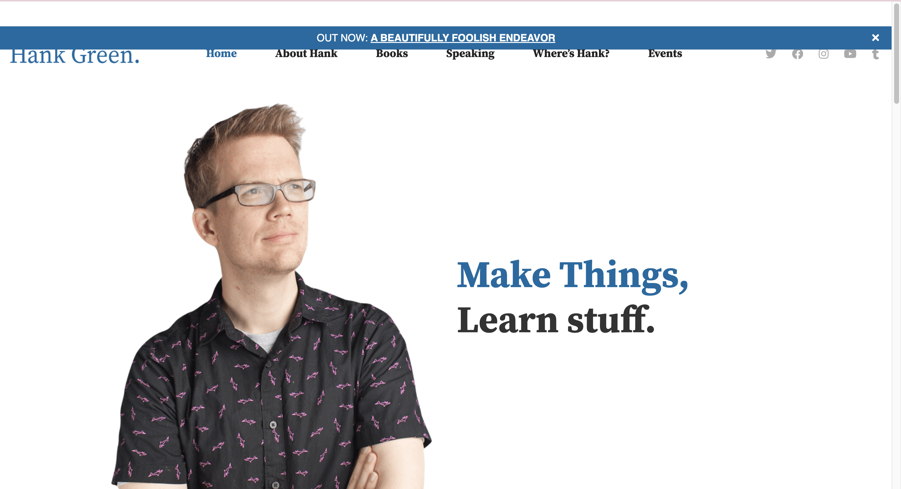
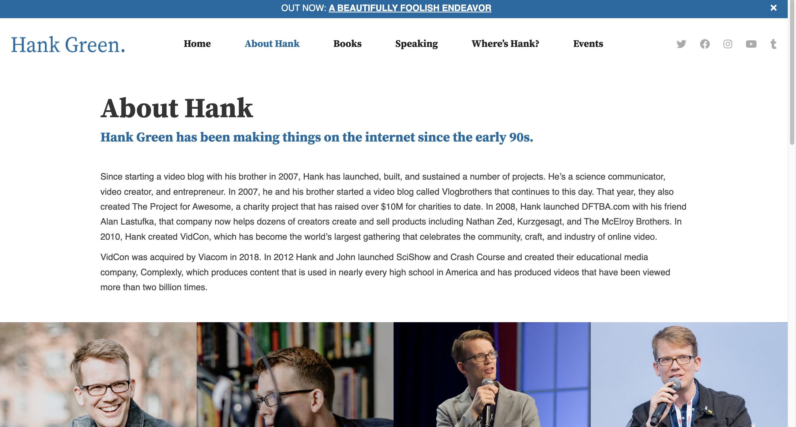

# Project 1, Final Milestone: Design Journey

**Replace ALL _TODOs_ with your work.** (There should be no TODOs in the final submission.)

Be clear and concise in your writing. Bullets points are encouraged.

Place all design journey images inside the "design-plan" folder and then link them in Markdown so that they are visible in Markdown Preview.

**Everything, including images, must be visible in _Markdown: Open Preview_.** If it's not visible in the Markdown preview, then we can't grade it. We also can't give you partial credit either. **Please make sure your design journey should is easy to read for the grader;** in Markdown preview the question _and_ answer should have a blank line between them.

## Milestone 3 Feedback Revisions
> Explain what you revised in response to the Milestone 3 feedback (1-2 sentences)
> If you didn't make any revisions, explain why.

I didn't lose any points, so I didn't revise anything due to the rubric; I had excellent Feedback. However, I added more content to my courses.html, I felt it was a little bare and didn't want to risk it. I also went ahead and resized all my images to be less than 1 mb.

## Example Website Emotion Analysis

For each example website you identified in milestone 1:

1. Include the same screenshot of the example website you included in Milestone 1.
2. Reflect on the emotions your experience when using the website.
3. Analyze how the website's use of color, decorative imagery, typography, shape, and alignment contribute to these emotions.

### Example Website 1
> Provide the website's URL and a screenshot
<https://www.lisakaltenegger.com/>

> What emotions do you feel when you look at this website's design? (1 sentence)

I feel a sense of mystique and awe, the use of spacious text and studious fonts make the site seem more intellectual and informative.

> How does this website's use of color, decorative imagery, typography, shape, and alignment contribute to these emotions? (2-3 sentences)

the cool colors, the gothic/studious fonts, and the spacious layout make it all seem meticulously placed. Everything seems to be very calm and yet stoic, nothing too cute, makes the website mature.

### Example Website 2
> Provide the website's URL and a screenshot

<https://hankgreen.com/>

> What emotions do you feel when you look at this website's design? (1 sentence)
This website seems more jolly, and easy going.

> How does this website's use of color, decorative imagery, typography, shape, and alignment contribute to these emotions? (2-3 sentences)

The amount of free space, casual/rounded fonts, and the light pastel coloring helps contribute to a sense of easy going and calmness. It makes the website seem peaceful and leisurely, there's no sharp edges.

## Website Design

### Emotion Reflection
> What emotions would you like the visitors of your website to experience? Why? (1-2 sentences)

I'd like to create a leisurely, homely feeling. I don't want my website to feel like a chore/hostile, I want it to be welcoming so people feel relaxed and inclined to stay longer.

### Design Principle Brainstorm
> Reflect on how you might use color, decorative imagery, typography, shape, and alignment to evoke these emotions. (2-3 sentences)

I would use softer fonts, less boxy elements, and cool colors that are pastel shadded. I wouldn't want to add anything too harsh on the eyes.

### Home Page Sketches
> Sketch **two** different possible designs for your home page.
> Provide an explanation for each sketch explaining the idea. (1 sentence per sketch)

Sketch two utilizes side by side layout more, espectially for pitures. I find that in sketch 1, which more of a just section on section on section design, I prefer the efficiency of space from sketch2.

### Entire Website's Design
> Pick the version of the home page that you will use for your final design.

> Plan the design for the rest of your website.
> Include a sketch for each of the remaining pages of your website.
> Label each sketch, so that we understand what page we are reviewing. (1 short phrase per sketch)

TODO: site sketches

### Static Website Design Check
> We're building a static website without interactivity.
> **No part of your website may dynamically change.**
> Examples of dynamic behavior are dropdown menus, hamburger menus, popups, modals/lightboxes, image carousels, etc.
> Audit your design and check that you aren't relying on any dynamic features. (1 sentence)

TODO: Explain why your site's design is completely static and lacks any dynamic behavior.

## Self-Reflection
> Take some time here to reflect on how much you've learned since you started this class. It's often easy to ignore our own progress. Take a moment and think about your accomplishments in this class. Hopefully you'll recognize that you've accomplished a lot and that you should be very proud of those accomplishments!

TODO: reflection

## References

### Collaborators
> List any persons you collaborated with on this project.

TODO: list your collaborators

### Reference Resources
> Did you use any resources not provided by this class to help you complete this assignment?
> List any external resources you referenced in the creation of your project. (i.e. W3Schools, StackOverflow, Mozilla, etc.)
>
> List **all** resources you used (websites, articles, books, etc.), including generative AI.
> Provide the URL to the resources you used and include a short description of how you used each resource.

TODO: list reference resources
