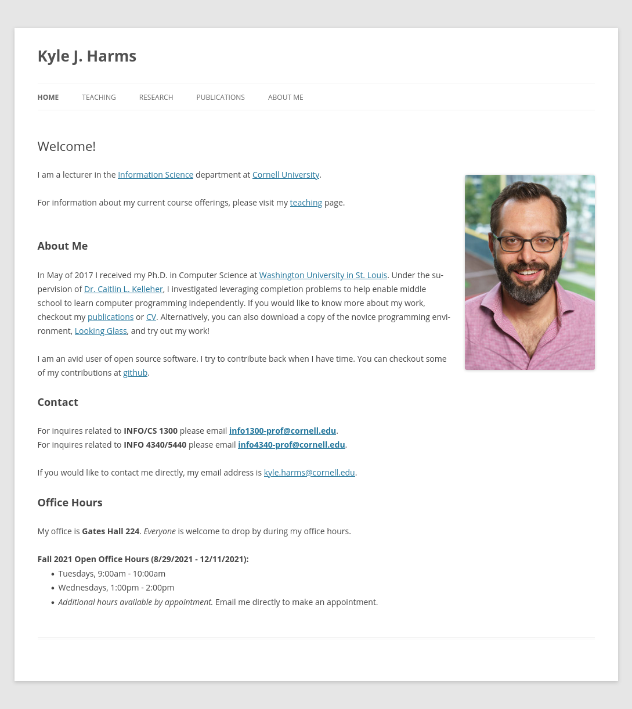

# Project 1, Milestone 1: Design Journey

[← Table of Contents](design-journey.md)

**Replace ALL _TODOs_ with your work.** (There should be no TODOs in the final submission.)

Be clear and concise in your writing. Bullets points are encouraged.

Place all design journey images inside the "design-plan" folder and then link them in Markdown so that they are visible in Markdown Preview.

**Everything, including images, must be visible in _Markdown: Open Preview_.** If it's not visible in the Markdown preview, then we can't grade it. We also can't give you partial credit either. **Please make sure your design journey should is easy to read for the grader;** in Markdown preview the question _and_ answer should have a blank line between them.

## Markdown Instructions

**TODO: delete this section before submission.**

This is a Markdown file. All written documents that you will submit this semester will be Markdown files. Markdown is a commonly used format by developers and bloggers. It's something that you should know. Learning it is a learning objective of this course.

**Please use the official [Markdown Reference Documentation](https://commonmark.org/help/) if you aren't sure how to "code" Markdown.**

This is an example for inserting images into Markdown:

**TODO: delete this section before submission.**

## Website Topic
> Briefly explain what your website will be about. Share your vision of your personal website. (1 sentence)
>
> Example: (TODO: delete this) My website will be about the Grassroots festival in Trumansburg NY.

TODO: tell us about your website

## Personal Website Design Exploration

Identify two personal websites (preferably static websites) that exist today on the web. You will be drawing inspiration from these sites for your own site; **please select websites that are similar to the website you wish to create**. You may not use the instructor's website or template websites for this part; the example websites should be real personal websites that exist on the web.

Include a **mobile** screenshot of the home page for each site. (If you're taking a screenshot on your laptop, resize your browser window to a mobile size before taking the screenshot.)

**We'll refer to these are your "example websites."**

### Personal Website 1 Review

> TODO: This example shows how to include a screenshot. Remove this example in your submission.
> Note: **You may not use the instructors' websites for this part.**
>
> <https://kharms.infosci.cornell.edu/>   ← TODO: put the URL between < and >
>
>    ← TODO: put the screenshot filename in the parentheses

<TODO: website url>

- Who do you think this site is designed for? Who is its intended audience?

    TODO: (1 sentence)

- What **goals** do you think the audience likely has when visiting this site.

    TODO: (1-2 sentences)

- What **content** is included in this personal website?

    TODO: (1-2 sentences)

- Do you believe the content likely **addresses** the goals of the site's audience?

    TODO: (1 sentence)

- What do you like about the design?

    TODO: (1-2 sentences)

### Personal Website 2 Review

<TODO: website url>

- Who do you think this site is designed for? Who is its intended audience?

    TODO: (1 sentence)

- What **goals** do you think the audience likely has when visiting this site.

    TODO: (1-2 sentences)

- What **content** is included in this personal website?

    TODO: (1-2 sentences)

- Do you believe the content likely **addresses** the goals of the site's audience?

    TODO: (1 sentence)

- What do you like about the design?

    TODO: (1-2 sentences)

## Audience
> Briefly explain who the intended audience is for your website. (1 sentence)

TODO: site's audience

## Audience Goals
> Why would your audience visit your site?
>
> Identify at least 3 goals that your users have for visiting your website.

1. TODO: (1 sentence)

2. TODO: (1 sentence)

3. TODO: (1 sentence)

## Audience Reflection
> Your audience should be a **cohesive** group of people with similar goals.
> Your audience should not be overly broad. (i.e. "recruiters")
> Your audience should not be arbitrary specific. (i.e. "recruiters located in midtown NYC")
> Your audience should describe a group of people who have the same goals.
>
> Explain why your audience is a cohesive group of people with uniform goals. (1-2 sentences)

TODO: audience rationale

## Content Reflection
> Review the example website's content for inspiration.
> Review your audience's goals.
> Identify the content your audience would need to achieve their goals.

- TODO: content description 1
- TODO: content description 2
- TODO: content description 3
- ...

## Planned Content
> List **all** the content you plan to include in your personal website.
>
> **Do not include your actual content here!** (All content should be located in the `design-plan/tmp-content` folder.)
> Simply provide a **very short description** of each piece of content.
>
> Examples:
>
> - headshot image
> - bio paragraph
> - PDF of class schedule
> - screenshot of main app screen of XYZ project
>
> You should list all types of content you planned to include (i.e. text, photos, images, etc.)

- TODO: content description 1
- TODO: content description 2
- TODO: content description 3
- ...

## Content Justification
> Explain why this content is the right content for your site's audience and how the content addresses their goals.
> (2-4 sentences)

TODO: justify your content decisions

## Home Page Content
> What is the content that your users would expect when visiting your site for the first time.
> **List** what content you will include on the homepage.

- TODO: homepage content description 1
- TODO: homepage content description 2
- TODO: homepage content description 3
- ...

## References

### Collaborators
> List any persons you collaborated with on this project.

TODO: list your collaborators

### Reference Resources
> Did you use any resources not provided by this class to help you complete this assignment?
> List any external resources you referenced in the creation of your project. (i.e. W3Schools, StackOverflow, Mozilla, etc.)
>
> List **all** resources you used (websites, articles, books, etc.), including generative AI.
> Provide the URL to the resources you used and include a short description of how you used each resource.

TODO: list reference resources

[← Table of Contents](design-journey.md)
