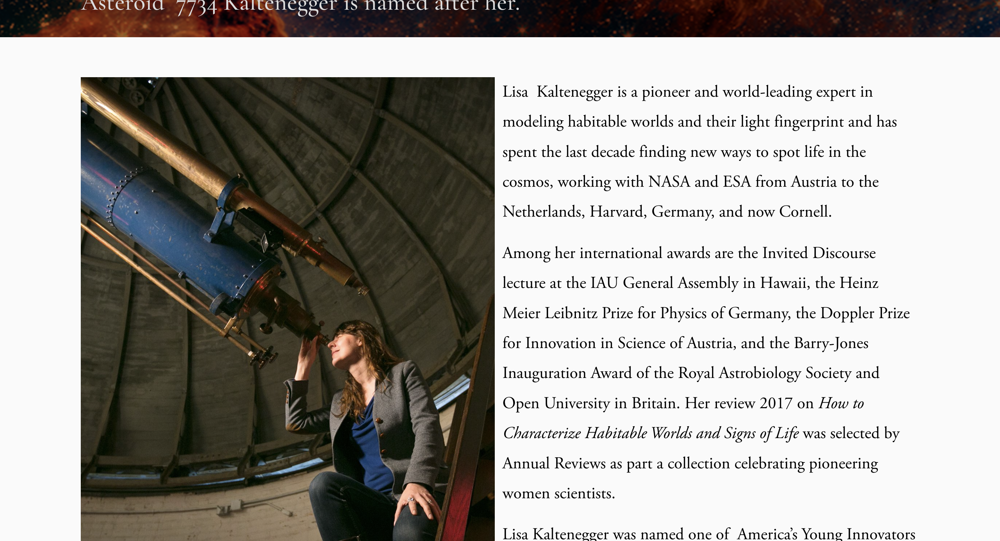
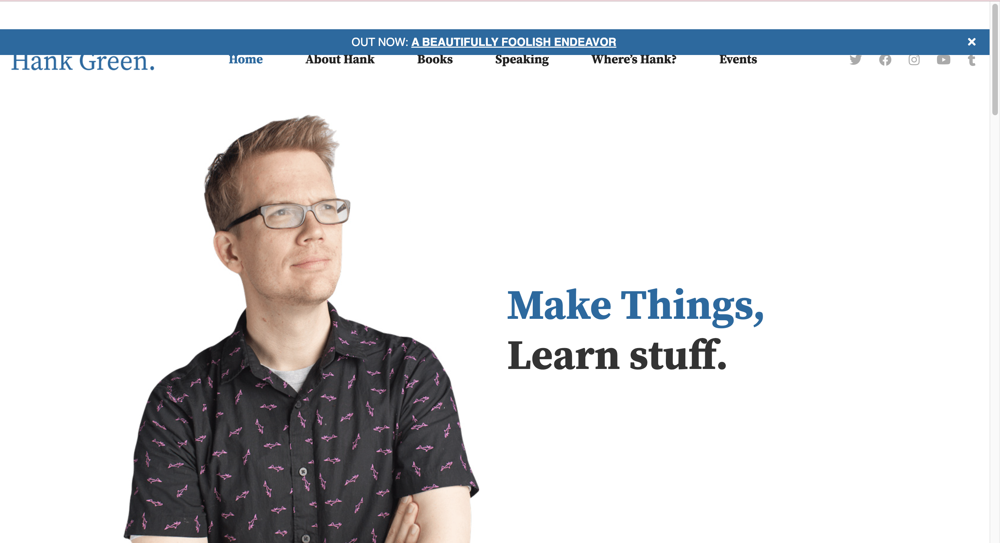
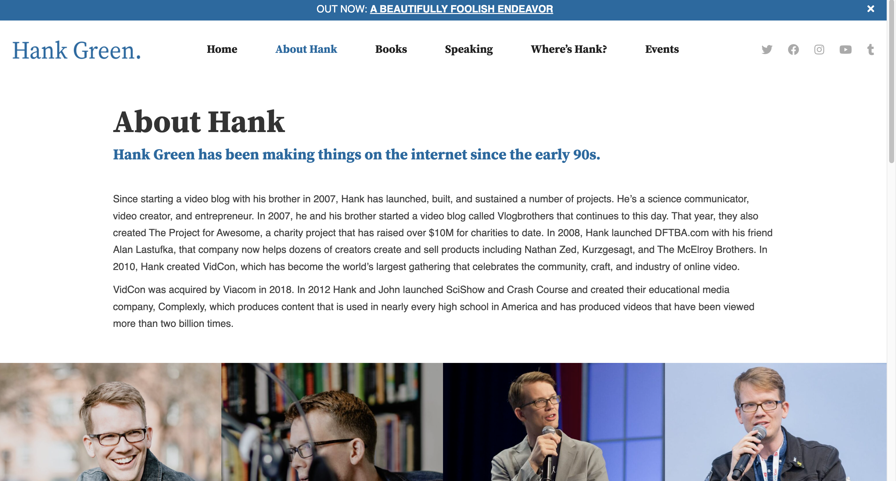

# Project 1, Milestone 1: Design Journey

[← Table of Contents](design-journey.md)

**Replace ALL _TODOs_ with your work.** (There should be no TODOs in the final submission.)

Be clear and concise in your writing. Bullets points are encouraged.

Place all design journey images inside the "design-plan" folder and then link them in Markdown so that they are visible in Markdown Preview.

**Everything, including images, must be visible in _Markdown: Open Preview_.** If it's not visible in the Markdown preview, then we can't grade it. We also can't give you partial credit either. **Please make sure your design journey should is easy to read for the grader;** in Markdown preview the question _and_ answer should have a blank line between them.

## Markdown Instructions

## Website Topic
> Briefly explain what your website will be about. Share your vision of your personal website. (1 sentence)

 My website will document my time in Ithaca, discussing classes, restaurants, and activities.

## Personal Website Design Exploration

Identify two personal websites (preferably static websites) that exist today on the web. You will be drawing inspiration from these sites for your own site; **please select websites that are similar to the website you wish to create**. You may not use the instructor's website or template websites for this part; the example websites should be real personal websites that exist on the web.

Include a **mobile** screenshot of the home page for each site. (If you're taking a screenshot on your laptop, resize your browser window to a mobile size before taking the screenshot.)

**We'll refer to these are your "example websites."**

### Personal Website 1 Review

> Note: **You may not use the instructors' websites for this part.**

<https://www.lisakaltenegger.com/>

- Who do you think this site is designed for? Who is its intended audience?

    I think this website was designed for those interested in Professor Lisa Kaltenegger's work. It was intended for people already familiar with her research and instead wanted to see what she was currently up to.

- What **goals** do you think the audience likely has when visiting this site.

    Get an idea as to what upcoming seminars she has, what recent talks she has gone on. They can catch up on all her newest postings, including lectures, articles, etc.

- What **content** is included in this personal website?

    This personal website displays all of Lisa's past research, her current classes taught, books she's written, and media content that she is creating. Additionally it has all of her contact information and past works.

- Do you believe the content likely **addresses** the goals of the site's audience?

    Yes, this website is sorted into very specific headers, so that all the different kinds of work that Lisa has done is distributed across more accessible and understandable divisions. This allows peers and fans to find the specific work they are looking for.

- What do you like about the design?

    I like how professional and detailed the design is. The specificity and descriptive nature of each tab allows for the content to be grouped in a high level so that there is less ambiguity for the website viewer.

### Personal Website 2 Review

<https://hankgreen.com/>

- Who do you think this site is designed for? Who is its intended audience?

    This website was intended for fans of Hank Green and customers.

- What **goals** do you think the audience likely has when visiting this site.

    To find out when Hank's next book is coming out, or when his next show is. This website is up to date with all content and ideas from Hank Green.

- What **content** is included in this personal website?

    Information about Hank Green's book releases, Hank Green shows, current works, and past works. Additionally, has miscellanious silly content here and there.

- Do you believe the content likely **addresses** the goals of the site's audience?

    Yes. This website has a great approach the embodies Hank Green's attitude, and conveys all the necessary information about his biography, his books, and his events.

- What do you like about the design?

    I love how this website is just uniquely Hank Green. The website colors, design, font, and layout all seem to resonate with the values and behaviors of Hank Green, showing how personal and planned out it was.

## Audience
> Briefly explain who the intended audience is for your website. (1 sentence)

My site's intended audience would be my friends/family that are interested in my time at the Cornell/Ithaca area.

## Audience Goals
> Why would your audience visit your site?
>
> Identify at least 3 goals that your users have for visiting your website.

1. to see what classes I've taken at Cornell

2. To see the restaurants I've eaten at in the Ithaca area

3. To see what I do for fun/see what I have upcoming

## Audience Reflection
> Your audience should be a **cohesive** group of people with similar goals.
> Your audience should not be overly broad. (i.e. "recruiters")
> Your audience should not be arbitrary specific. (i.e. "recruiters located in midtown NYC")
> Your audience should describe a group of people who have the same goals.
>
> Explain why your audience is a cohesive group of people with uniform goals. (1-2 sentences)

My audience would be loved ones who have a genuine care for my day to day activities at Cornell. These are friends far away or family members who love to see my joys and want to keep in touch with me. These people would all be excited to see the hard classes I take or the delicious foods I eat while I am away so we can talk about them the next time we catch up.

## Content Reflection
> Review the example website's content for inspiration.
> Review your audience's goals.
> Identify the content your audience would need to achieve their goals.

- The audience would need to see the exciting events in my life
- The audience would need to see the classes I take per semester
- The audience would need to see the next times I return home
- The audience would benefit from seeing all my upcoming milestones
- ...

## Planned Content
> List **all** the content you plan to include in your personal website.
>
> **Do not include your actual content here!** (All content should be located in the `design-plan/tmp-content` folder.)
> Simply provide a **very short description** of each piece of content.
>
> Examples:
>
> - headshot image
> - bio paragraph
> - PDF of class schedule
> - screenshot of main app screen of XYZ project
>
> You should list all types of content you planned to include (i.e. text, photos, images, etc.)

- I would like to have a headshot/or just a candid picture of me
- All my course schedules
- my opinion on each course I've taken
- All the restaurants I've eaten at in the past few years in Ithaca
- Things I have scheduled to look forward to
- Major achievements I've accomplished while at Cornell
- Unique phenomenon (like eclipses, meteor showers, etc) I've witnessed at Cornell

## Content Justification
> Explain why this content is the right content for your site's audience and how the content addresses their goals.
> (2-4 sentences)

Having these things on my page are all necessary in giving unique and fresh updates to my friends and family. Things that they know I enjoy, such as food and nature, allow my personality to shine through and allow them to feel my presence. Additionally, for my parents and friends closely invested in academia, seeing the classes I take would be a refreshing reminder of the strength of Cornell's education. Seeing all the interesting and diverse content give my friends and family new talking points and things to update about when we meet again.

## Home Page Content
> What is the content that your users would expect when visiting your site for the first time.
> **List** what content you will include on the homepage.

- A candid picture of myself
- a brief biography of whatever I am up to in that semester/time of year
- things I want to accomplish by a certain deadline

## References

### Collaborators
> List any persons you collaborated with on this project.

No colaborators

### Reference Resources
> Did you use any resources not provided by this class to help you complete this assignment?
> List any external resources you referenced in the creation of your project. (i.e. W3Schools, StackOverflow, Mozilla, etc.)
>
> List **all** resources you used (websites, articles, books, etc.), including generative AI.
> Provide the URL to the resources you used and include a short description of how you used each resource.

Hank Green's Website <https://hankgreen.com/>. I used it to inspire my design

Lisa Kaltenegger's Website. I used it to inspire my own webiste. <https://www.lisakaltenegger.com/>

[← Table of Contents](design-journey.md)
