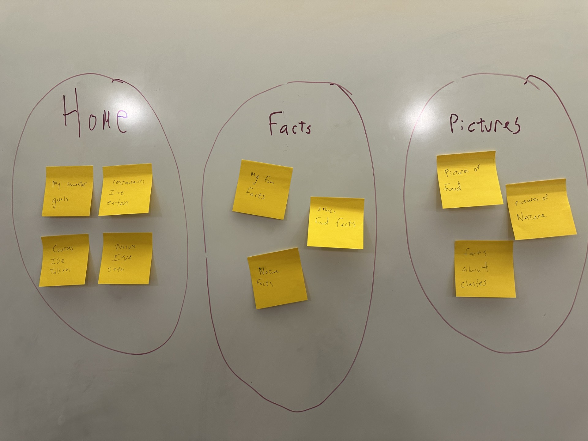
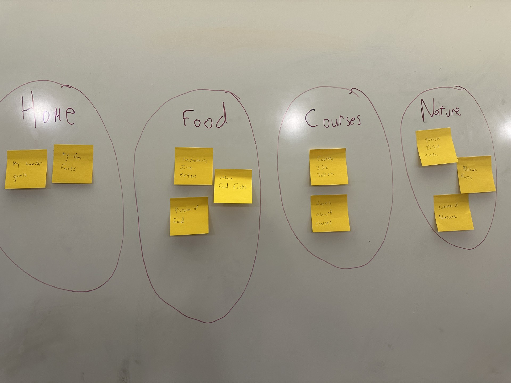

# Project 1, Milestone 2: Design Journey

For milestone 2, you will design the information architecture for all the pages of your website.  Your milestone 2 design journey will document this process.

**Replace ALL _TODOs_ with your work.** (There should be no TODOs in the final submission.)

Be clear and concise in your writing. Bullets points are encouraged.

Place all design journey images inside the "design-plan" folder and then link them in Markdown so that they are visible in Markdown Preview.

**Everything, including images, must be visible in _Markdown: Open Preview_.** If it's not visible in the Markdown preview, then we can't grade it. We also can't give you partial credit either. **Please make sure your design journey should is easy to read for the grader;** in Markdown preview the question _and_ answer should have a blank line between them.

## Milestone 1 Feedback Revisions
> Explain what you revised in response to the Milestone 1 feedback (1-2 sentences)
> If you didn't make any revisions, explain why.

In my feedback, I was told my text content was not sufficient enough for 3-5 pages worth of text. So  I revised my text content to be more thorough and hit the goal of being sufficient for the rubric outline.

## Information Architecture

Design the information architecture for all the pages your website.

You may change your homepage content based on your card sorting. If you do change the homepage content, you don't need to go back to the previous milestone design journey and update it. Instead, just include the new plan in the section below (Content Organization).

### Content Organization
> Document your **iterations** of card sorting here.
> You should have at least 2 iterations of card sorting.
> Include photographic evidence of each iteration of card sorting **and** description of your thought process for each iteration. (1-2 sentences)
> Please physically sort cards; please don't do this digitally.

 I made pages and grouped content based on the type of content on each page. So I had less pages, and had a page dedicated with just facts, just photos, and just things about myself. This would mean the pictures tab was just all pictures, nature, food, etc and the facts would be all facts, food facts, nature facts, me facts, courses facts. This felt too overwhelming as the pictures tab would be all pictures and the facts would be all text. While very organized in principle, the grouping of content would be spread out across 3 pages. Say someone wanted to see all my restaurant information, then they would have to open 3 pages just to get the whole understanding on restaurants.

This iteration i was inspired by Hank Green (one of my website page inspos). This way seems more tedious for me, in that I would have to group content by the theme of the content (all the food together on one page, all the nature, etc). However, this seemed like the way to go as each page had less sticky notes per page, making it more viewable, and the stickynotes all related directly and can work together on the same page.

### Final Content Organization
> Which iteration of card sorting will you use for your website? (1 sentence)

the second Iteration , grouping based on theme as it was less cluttered.

> Explain how the final organization of content is appropriate for your site's audiences. (1-2 sentences)

Now, this way if an audience member wanted to see what Classes I was taking, they only had to open one page, versuses in iteration 1, they would have to find the information across two pages.

### Navigation
> Please list the pages you will include in your website's navigation.

- page 1: home
- page 2: food
- page 3: courses
- page 4: nature

> Explain why the names of these pages make sense for your site's audience. (1-2 sentences)
Each page name has the direct context of what the page is about. If my mom wanted to just see the food I was eating, she can find all the info on the food tab, Whereas my dad would probably just want to see the classes I was taking, which is all conveniently located in the courses.

## References

### Collaborators

no collaborators

### Reference Resources

I used w3school to help me with the formatting of the HTML and learning footers, https://www.w3schools.com/html/

https://chat.com

I used ChatGPT to help beef up my content and help me research information about specifiv weather phenomenon, restaurants in Ithaca, and classes offered at Cornell.
