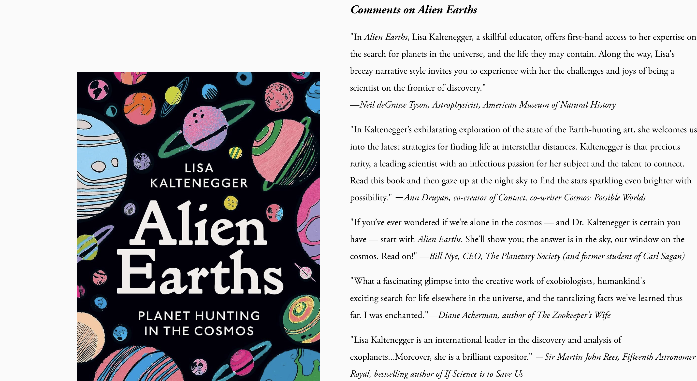

# Project 1, Milestone 3: Design Journey

In milestone 3 you will analyze your example websites use of CSS properties and create a styled **draft** of your personal website's homepage.

**Replace ALL _TODOs_ with your work.** (There should be no TODOs in the final submission.)

Be clear and concise in your writing. Bullet points are encouraged.

Place all design journey images inside the **`design-plan`** folder and then link them in Markdown so that they are visible in Markdown Preview.

**Everything, including images, must be visible in _Markdown: Open Preview_.** If it's not visible in the Markdown preview, then we can't grade it. We also can't give you partial credit either. **Please make sure your design journey should is easy to read for the grader;** in Markdown preview the question _and_ answer should have a blank line between them.

## Milestone 2 Feedback Revisions
> Explain what you revised in response to the Milestone 2 feedback (1-2 sentences)
> If you didn't make any revisions, explain why.

I lost points for lack of citations, lack of indentations, and therefore an invalid document. I was also suggested to use sectoins and add more content to index.html. So my changes were I added more content to index.html, used sections, and added citations.

## Example Website CSS Property Analysis

For each example website you identified in milestone 1:

1. Include the same screenshot of the example website you included in Milestone 1.
2. Identify 2 parts of the design that you want to analyze for CSS properties.
3. For each part of the design, list the CSS properties for shape, color, and typography that you might use to create a similar design on your personal website.

### Example Website 1 CSS Property Analysis

<https://www.lisakaltenegger.com/>

1. I like the Contact button

    Shape CSS Properties:
    border-width: var(--primary-button-stroke);
    padding: var(--primary-button-padding-y) var(--primary-button-padding-x);

    here are the variable values
        --primaryButtonPadding: 1.2em;
    --primary-button-padding-x: 2.004em;
    --primary-button-padding-y: 1.2em;
    --primary-button-stroke: 2px;

    Color CSS Properties:

    color: var(--primaryButtonBackgroundColor);
    border-color: var(--primaryButtonBackgroundColor);

    both were black

    Typography CSS Properties:

      - font-weight: var(--header-button-font-font-weight);
      - font-size: calc((var(--header-button-font-font-size-value) - 1)* 1.2vw + 1rem);

2.  I like the second paragraph

    Shape CSS Properties:

      -     display: block;
    - margin-block-start: 1em;
   -  margin-block-end: 1em;

      - ...

    Color CSS Properties:

     color: black;
      background-color: white;

    Typography CSS Properties:

- font-family: var(--body-font-font-family);
      font-style: italic;

  here are those values:

    --body-font-font-family: adobe-garamond-pro;
    --body-font-font-style: normal;
    --body-font-font-weight: 300;

### Example Website 2 CSS Property Analysis

<https://hankgreen.com/>

1. I like the dual color and font of the title

    Shape CSS Properties:

    - margin-block-start: 1em;
   -  margin-block-end: 1em;

    Color CSS Properties:

      -    color: #006ba3;
      - color: #333;
      - two tone title

    Typography CSS Properties:

      - font-size: 6rem;
      font-family: "Source Serif Pro", sans-serif;
    font-weight: 400;

2. i like how the nav bar words look

    Shape CSS Properties:
    margin-top: 0;
    margin-right: 0;
    margin-bottom: 0;
    margin-left: 0;
    padding-top: 20px;
    padding-right: 20px;
    padding-bottom: 20px;
    padding-left: 20px;

    Color CSS Properties:

      -     background-color: #fff;
      - color: #444;

    Typography CSS Properties:

      -     font-family: "Source Sans Pro", sans-serif;
      - font-weight: 400;
      - font-style: normal;

## CSS Styling Plan
> Pick one of the examples websites, or parts from each website, to use as inspiration to begin styling your personal website.
> Explain why you chose the example website, or parts from each, and how you plan to use it as inspiration for styling your personal website.

I chose the hank green website. The elements are easier to read, as they don't use variables like the lisakaltenegger website does. I also liked the simplistic colors and fonts, so I plan to use hank green as inspriation for my text and headers.

TODO: Why did you choose this example website, or parts from each website? How do you plan to use it as inspiration for styling your personal website? (1-2 sentences)

I really like how simplistic the colors are on hank green's website, often having two colors as he puts text on two different lines. I will use this for my headers as well. Bonus: he also uses cool hexcodes (i.e. 333, 444, etc) that I find charming.

## References
<https://hankgreen.com/>
<https://lisakaltenegger.com/>
https://www.w3schools.com/css/default.asp

### Collaborators
> List any persons you collaborated with on this project.

no one

### Reference Resources
> Did you use any resources not provided by this class to help you complete this assignment?
> List any external resources you referenced in the creation of your project. (i.e. W3Schools, StackOverflow, Mozilla, etc.)
>
> List **all** resources you used (websites, articles, books, etc.), including generative AI.
> Provide the URL to the resources you used and include a short description of how you used each resource.

I wanted to use the Lab4 as the inspiration for the css elements. I also like the coloring and shaping from lab4

i used w3 schools for help with linking the styles to html

https://www.w3schools.com/css/default.asp

I asked chatgpt to help refresh my memory on how to format the sections for revisions, chat.com

I used chatgpt to explain how to do the linking of the styles to the html homepage
I used w3schools and the sylabus to find citation guides
